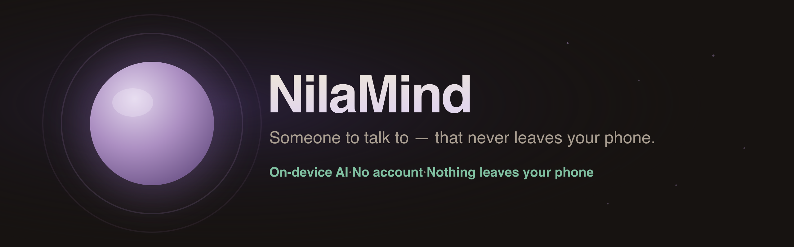

<p align="center">
  
</p>

<p align="center">
  <a href="LICENSE"></a>
  
  <a href="https://github.com/sampathmannam/nilamind/releases/latest"></a>
  
  <a href="SAFETY.md"></a>
</p>

<h1 align="center">NilaMind</h1>

<p align="center"><b>A privacy-first, fully on-device mental-health companion.</b> · <a href="https://nilamind.netlify.app">try it in your browser →</a></p>

NilaMind is a mobile app built around *Nila* — someone you can talk to (by voice
or text) for everyday emotional support. The **language model, the crisis-safety
checks, and all your data run on your phone**. There is **no account, no backend,
and no analytics** — your conversations, check-ins, mood, and notes never
leave the device.

> **Voice stays on the phone too.** When you *speak* to Nila, your words are
> transcribed **on-device** by default (Vosk — the same engine as the wake word),
> so nothing you say leaves the phone. An optional setting can switch to your
> device's system recognizer (a little more accurate, but it may use the cloud).

> ⚠️ **Please read [`SAFETY.md`](SAFETY.md) first.** NilaMind is an experimental
> self-help tool — **not a medical device, not therapy, and not a crisis
> service.** If you may be in danger, contact local emergency services. If you
> fork it, **keep the crisis-safety layer intact.**

---

📖 **Full documentation** — architecture, the on-device brain, the §9 safety design, privacy, features, building, and distribution — is in **[`docs/wiki/`](docs/wiki/)**.

## Try it now — in your browser

### 👉 [**nilamind.netlify.app**](https://nilamind.netlify.app)

No install, no account, nothing to download — open it and start talking. The
reflective check-ins, the evidence-based coping tools, and the **crisis-safety
layer (§9)** all run **client-side in your browser**: your words, check-ins, and
notes stay on your device (no backend, no analytics). It works on your phone or
laptop, and installs as a PWA if you want it on your home screen.

The web version is the *instant* front door, meeting you where you are right now.
The **Android app** below is the deeper home — it adds the full **on-device
language model** for richer, in-her-own-words conversation, **on-device voice**,
and compounding memory. Same NilaMind, same one rule: *help is the only metric.*

## Install

**Recommended — [Obtainium](https://obtainium.imranr.dev) (auto-updates):** install Obtainium, then [**➕ Add to Obtainium**](https://apps.obtainium.imranr.dev/redirect?r=obtainium://add/https://github.com/sampathmannam/nilamind) — or in Obtainium tap *Add App* and paste `https://github.com/sampathmannam/nilamind`. Obtainium installs NilaMind straight from GitHub Releases and keeps it updated automatically. This is the F-Droid-ecosystem home for an app this size (no store size limit).

**Or install the APK directly:** grab the latest signed APK from [**Releases**](https://github.com/sampathmannam/nilamind/releases), or visit the [**landing page**](https://sampathmannam.github.io/nilamind/).

On first run the app downloads its on-device model (~806 MB, over Wi-Fi, integrity-verified) and then works fully offline. Requires **Android 7.0+ (arm64)**. Step-by-step: [`docs/wiki/Getting-Started.md`](docs/wiki/Getting-Started.md).

**Build it:** see *Build & run* below.

## Why it exists

It was built as a personal research project by someone with lived experience of
mental illness — to support people who are struggling and may not feel able to
open up to anyone. It is shared openly so others can learn from it and build on it.
The one rule it holds above all: **help is the only metric — never gather data
at any cost.**

The design is grounded in research, not vibes. The reasoning, with citations,
is in [`docs/NILA_AGENT_DESIGN.md`](docs/NILA_AGENT_DESIGN.md) and
[`docs/UX_RESEARCH.md`](docs/UX_RESEARCH.md).

**Transparency, evidence & honesty** (we try hard not to overclaim):
[`docs/TRANSPARENCY.md`](docs/TRANSPARENCY.md) — model card, the deterministic §9 safety
architecture, and a privacy datasheet · [`docs/EVIDENCE.md`](docs/EVIDENCE.md) — what the
evidence does and doesn't show, feature by feature · [`docs/APP_EVALUATION.md`](docs/APP_EVALUATION.md) —
an honest self-assessment against the APA App Evaluation Model and NICE ESF · [`docs/PILOT_PROTOCOL.md`](docs/PILOT_PROTOCOL.md) —
how we'd actually measure whether it helps.

## How Nila actually works

A small model that runs on a phone is **not** a good free-form therapist, and
NilaMind doesn't pretend otherwise. Instead the roles are split so the app leans
on what each part does *reliably*:

- **Nila (the model) does the listening** — a brief, warm reflection of what you
  said. Short, human, in her own words. That's the one thing a small on-device
  model does well.
- **The app carries the "what to do"** — after each reply, NilaMind surfaces the
  right **evidence-based tool** (a DBT/CBT/ACT/self-compassion skill, a grounding
  or breathing exercise, a wind-down flow) chosen *deterministically from your own
  words*, one tap away. The reliable help doesn't depend on the model's phrasing.
- **Crisis is never the model's job** — a deterministic, model-independent safety
  layer (below) owns that.

This is deliberate: the model stays fixed and small; the *app's* strengths —
research-grounded tools, guided flows, private memory — do the heavy lifting.

## What's inside

- **On-device LLM** via [`llama-cpp-capacitor`](https://www.npmjs.com/package/llama-cpp-capacitor)
  (runs a GGUF model locally — see *Bring your own model* below).
- **Voice-first chat** — talk to Nila and hear her reply; typing always
  available. **Speech-to-text runs on-device by default** (Vosk WASM, the same
  engine as the wake word) so your voice never leaves the phone; an optional setting
  switches to the system recognizer (`@capacitor-community/speech-recognition`) for
  extra accuracy. Text-to-speech uses the device's `text-to-speech` engine.
- **A model-independent crisis-safety layer ("§9")** — a deterministic keyword
  scanner plus a small on-device MiniLM classifier (ONNX Runtime Web) that catches
  euphemistic disclosures the keywords miss, surfaces support, and routes toward a
  human. Additive, soft, fail-closed — it wraps every input and every reply, and
  the model can never influence it. See [`SAFETY.md`](SAFETY.md).
- **Evidence-based tools, surfaced when they fit** — a research-grounded skills
  library (DBT/CBT/ACT/CFT), grounding & breathing, a sleep wind-down, an
  "understand" psychoeducation library, and a trusted-person reach-out bridge.
- **Structured programs** — evidence-based multi-step protocols for Behavioral
  Activation (depression), Worry Postponement (GAD), Self-Compassion (shame), and
  Sleep Wind-Down (insomnia-safe for bipolar). Deterministic step prompts, no model
  hallucination. Resume across app restarts.
- **Mania-first safeguards** — elevation guard detects med-stopping, grandiosity,
  impulsive spending, racing thoughts, pressured speech, hypersexuality, and sleep-
  denial euphoria. Anti-sycophancy Rule 6 blocks validation of manic delusions.
- **Emotion granularity coaching** — a curated 72-word emotion vocabulary organized into 6 families
  helps name feelings more precisely ("betrayed", not just "angry"). The check-in routes your mood to
  1 of the 6 families and offers a short shortlist of words. Built into the 4-step check-in.
- **Between-sessions brain** — overnight reflection reads your day's conversation,
  extracts what mattered, and seeds a warm morning greeting. Weekly synthesis
  surfaces gentle patterns you might not notice yourself.
- **CBT scaffolding** — auto-drafts thought records from venting text; spots 10
  cognitive distortions (all-or-nothing, catastrophizing, labeling, etc.) and
  gently names them. Deterministic detection, model only narrates.
- **Local-only memory & tools** — durable profile/insights, daily reflection,
  mood tracking, a "letter to my unwell self" pact, and a dependency guard that
  nudges you toward real people. All stored **encrypted on-device** (AES-256-GCM
  via `secureLocal`; optional zero-knowledge PIN).
- **No data collection by design.**

**Stack:** React 19 · Vite 6 · Tailwind 4 · Capacitor 8 (Android) ·
Dexie (IndexedDB) · ONNX Runtime Web · Vosk · recharts.

## Bring your own model

**The language model is not bundled in this repository** (GGUF files are large
and licensed separately, and crisis-capable apps shouldn't ship a brain by
default). The installed app **downloads its model on first run** (integrity-verified,
over Wi-Fi); developers can side-load any GGUF instead:

- On the device, replies are produced by `src/services/llamaCppLlmAdapter.ts`
  from a **GGUF** — downloaded in-app on first run, or side-loaded by a developer
  (e.g. a Gemma-3-4B-Instruct GGUF). It is not committed to the app.
- `src/services/localLlm.ts` is a small seam so you can wire other on-device
  backends. For **desktop development** you can point it at a local
  [Ollama](https://ollama.com) model instead of a phone.

**Reference model (⚠️ research preview):** the project's own therapy-tuned Gemma-3-4B is a research
preview — **not** what the app installs by default. As of a 2026-07-11 speed swap, the default in-app
download is **Qwen2.5-1.5B-Instruct** (~1.1 GB, Apache-2.0 license, from
[`Qwen/Qwen2.5-1.5B-Instruct-GGUF`](https://huggingface.co/Qwen/Qwen2.5-1.5B-Instruct-GGUF)); the earlier
default, **Gemma-3-1B-it** (~806 MB), and the 4B research model are both restorable only via a one-line
catalog revert or a developer side-load. The 4B is published at
[`sampathmannam/nilamind-gemma-3-4b-GGUF`](https://huggingface.co/sampathmannam/nilamind-gemma-3-4b-GGUF).
Its main practical limitation is **repetitive/formulaic phrasing** (which is exactly why the app splits
the roles above — the tools carry the help), and it has **no built-in crisis-safety layer**. Read its
model card, keep the app's §9 layer in front of it, and don't treat it as a usable therapist. (An earlier
"role-confusion" concern turned out to be a single-turn eval-harness artifact — in the app's real prompt
shape the model stays in Nila's voice.)

Reply quality, latency, and failure modes depend entirely on the model you
choose. Re-test the safety layer against your model before any real use.

## A note on speed

Because the model runs **entirely on your phone**, the **first reply after a fresh
start** can take a couple of minutes on a slower device — it's reading a ~806 MB
model off storage, not "thinking." NilaMind keeps the model resident once loaded
(a foreground service) so **every reply after that stays fast** until the phone
reboots. On a phone with fast storage the wait is only a few seconds. Details and
the engineering trade-offs are in [`docs/NILA_SPEED_PLAN.md`](docs/NILA_SPEED_PLAN.md).

## Build & run

**Prerequisites:** Node.js 18+. For the Android app: Android Studio + a JDK.

```bash
npm install
```

**Web preview** (UI + logic; on-device LLM features are limited in the browser):

```bash
npm run dev
```

**Android device/emulator:**

```bash
npm run build
npx cap sync android
npx cap open android   # then Run on a device from Android Studio
```

Then side-load your GGUF onto the device so the on-device model can load.

**Useful scripts:** `npm run lint` (type-check) · `npm test` (Vitest — 1,234 tests,
incl. the §9 safety invariants). `VITE_STORE_BUILD=1` toggles the Play-Store build
profile (optional).

## Privacy & security

Personal content is stored **only on the device, encrypted at rest** (AES-256-GCM;
the key is non-extractable, or PIN-derived in optional zero-knowledge mode). There
is no server, no account, and no telemetry. The app makes only one network call —
the one-time, integrity-verified model download; after that it's fully offline,
**including voice** — speech-to-text runs on-device (Vosk) by default, so nothing
you say leaves the phone. (An optional setting can use the device's system speech
recognizer instead, which may use the cloud.) If you
modify NilaMind, **please don't add data collection** — that's the line the project
won't cross.

## Status

Experimental and personal (see the [release badge](https://github.com/sampathmannam/nilamind/releases/latest) above for the current version). Not clinically validated, not a product, no
support guarantees. Shared in the hope it's useful — use at your own risk.

## License

[Apache License 2.0](LICENSE) — provided **"AS IS", without warranty of any
kind.** See [`NOTICE`](NOTICE) and [`SAFETY.md`](SAFETY.md). If you redistribute
or fork NilaMind, keep the crisis-safety layer intact.
